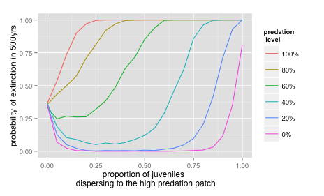
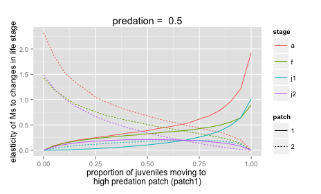

Appendicies
========================================================

APPENDIX A: Density Dependence

### Density Dependent model construction

Since this model off the Cascades frog, and amphibians are most likely to experience density-dependence in their aquatic life stage, I made only the larval survivorship density dependent (Altwegg 2003). The juvenile recruitment at time $t$ is now dependent on the number of juveniles alive at time $t (n_{Lt})$ with a rate of density dependence M. Described by an adapted version of the Beverton-Holt growth curve ($J_{it} = J_i / (1+ \frac{n_{J_{it}}}{M})$) were $M$ is the related to the strength intra specific competition among larvae (Caswell 2001). $J_{it}$ is then multiplied by the predation percentage to determine number of juveniles in the next time step. This assumes density-dependent dynamics occur before predation, so that density dependence does not compensate for predation.

To test the effect of habitat choice on the density dependent version of the model, we plotted the probability of quasi-extinction after 500 years versus increase in proportion of juveniles dispersing to the predator patch (figure 5a), and the carrying capacity of each patch was 50 larvae. We set the quasi-extinction threshold for the metapopulation at 0.001 individuals.

### results

Measuring extinction probabilities an idea of population stability in the long term. With the baseline vital rates, the population only experienced extinctions at very predator levels (Data not shown). However, when the survival rate of adults was decreased by 40% in every scenario, the relationship between extinction probability and habitat preference was clear (figure 6). The lowest probability of extinction occurred when there was a slight preference for the predator-free patch. Extinction probabilities increased when there was total preference for the predator-free patch or preference for the predator patch.

### Discussion

The density dependent scenarios also showed a unimodal relationship between dispersal to the predator patch and probability of extinction (Fig. 7a and b). This is similar to a model by Howe et al. (Howe et al. 1991), that found a finite percentage of sink populations increased carrying capacity of a metapopulation with density dependent dispersal. The results of this model show that habitat preference may result in similar patterns as that shown by density dependent dispersal with different amounts of sink habitat.

Previous models of ecological traps did not show a uni-model realtionship because...

A high degree of density dependence may be enough to compensate for predation, also allowing a slight ecological trap to have a positive effect on overall population size and persistence. However, if a less-productive habitat is overwhelmingly preferred (which might occur with a predator-caused trophic cascade causing primary productivity to be correlated with predation) then an ecological trap may cause metapopulation extinction if frogs disperse from a predator-free patch before its carrying capacity is reached. The life stage that experiences the density dependence may also change the population dynamics. This model included density dependence only in juvenile recruitment since most studies of amphibians find this to be the most important, or only life stage with density dependent survival (Altwegg 2003). However, an organism with density dependence at a life stage less subject to predation may not be able to compensate as easily for predation losses, causing the metapopulation to fall below the expected carrying capacity (Sinclair and Pech 1996). There is also strong evidence for the buffering effect of high adult survivorship of the Cascades frog. Cascades frogs can live 10-12 years (Briggs and Storm 1970), and previous mark-recapture surveys of adult frogs showed year to year recapture probabilities of 0.73 (95% CI 0.67–0.78) (Pope 2008). The same study found that recruitment rate was more important than changes in adult survival in determining population growth rate, but our model indicates that high adult survival may be important in carrying the population through years of low recruitment.

Altwegg, R. 2003. Multistage density dependence in an amphibian. Oecologia 136:46-50.

Howe, R. W., G. J. Davis, and V. Mosca. 1991. The Demographic Significance of 'Sink' Populations. Biological Conservation 57:239-255.

Sinclair, A. R. E. and R. P. Pech. 1996. Density Dependence, Stochasticity, Compensation and Predator Regulation. Oikos 75:164-173.
Appendix B, Elasticity
======================

### Local Elasticity Analysis

To test the effect of small perturbations in the vital rates of the stochastic model, we calculated the elasticity of the stochastic growth rate using numerical simulation (Caswell 2001). Briefly, we adapting the code from Caswell (2001), to generate a series of metapopulation projection matrices based on the randomly fluctuating environmental states described above. We used this to generate a series of population structure vectors (v) and growth rates (R) projected forward in time and a series of reproductive value vectors (w) projected backwards in time. The elasticity matrix is:

$$\frac{\delta \log \lambda_s}{\delta \log a_{ij}} = 
   \lim_{tf \rightarrow \infty} \frac{1}{tf} \sum_{t=0}^{T-1}
   \frac{(v(t+1)w^T(t) \circ A_t}{R_t v^T (t+1) w (t+1)}$$

We repeated the stochastic elasticity calculation for 100000 years and plotted the elasticity of each non-zero matrix entry when the predation was 50% and varied dispersal to the predator patch between 0 and 1.

### Elasticity

The elasticity of$\log \lambda_s$to changes in each entry of the metapopulation projection matrix depends greatly on how attractive the patch is and what the predation percentage is. When the predation percentage is 50% and both patches are equally attractive, the metapopulation growth rate is most elastic to changes in survivorship of the no predation patch, especially fecundity and adult survival (Table 2).

patch|Fecundity|Migrants from predator patch|Migrants from patch non-predator patch|Adult survival Predator|0.2953|0.0904|0.1963|0.3333 Non-predator|0.5591|0.1644|0.3472|0.6621

Table 2b: Elasticities of$\log \lambda_s$to changes in the non-zero matrix elements of the metapopulation projection matrix when they have equal dispersal and predation is 50% in the predator patch.

However, the relative importance of each of these matrix elements changes with changes in both dispersal and predation. When predation is held equal at 50%, increasing the proportion of juveniles moving to the predator patch makes$\log \lambda_s$more elastic to changes in the predator patch matrix elements. Furthermore, juvenile migration becomes more important than fecundity when migration is strongly skewed toward one patch or the other (figure 2).

Figure 2. Elasticity of$\log \lambda_s$to each of the non-zero matrix elements in the metapopulation projection matrix with changes in the proportion of juveniles moving between patches. Predation percentage is held constant at 50%

