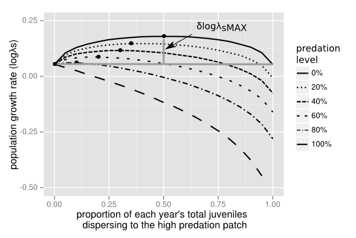
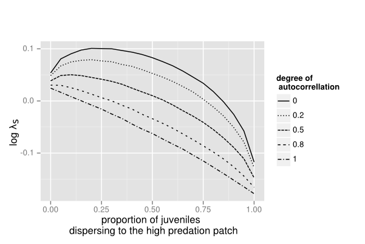

Building a better frog trap: The benefits of mal-adaptive habitat choice for metapopulations with different life history strategies.
====================================================================================================================================

Rosemary Hartman

and Noam Ross

(To see a version with the mathematical equations rendered, go to [the raw version here](https://rawgithub.com/rosehartman/frog-trap/master/trap_model_manduscript copy.html))

If you have feedback, please [submit an issue!](https://github.com/rosehartman/frog-trap/issues)

Abstract
--------

 By spatially distributing offspring among habitat patches in temporally varying environments, an organism can "hedge its bets" to protect against bad conditions in one patch. This strategy can maintain populations even when some or even all locations are, on average, population sinks. However, species may not have evolved this bet-hedging mechanism, especially when sink environments are anthropogenic "traps" - locations where traditional habitat cues have been altered. Using a model based on the life history of the Cascades frog (*Rana cascadae*), we examine the conditions that maximize growth in an environment with sinks created by the introduction of predators. In a temporally stochastic environment, maximum growth rates occur when some juveniles disperse to sinks. We then examine how different life histories and predation regimes affect the ability of an organism gain an advantage by bet-hedging, and find that bet-hedging can be less useful when the ecological trap drives adult, rather than juvenile, mortality.
=======

Introduction
------------

From deciding where to build a nest, deciding when to germinate, and deciding where to forage, organisms must attempt to use available information to make habitat choices with important fitness consequences. Most models of habitat selection within a metapopulation assume that the organism has perfect information about habitat suitability (Delibes et al. 2001a). However, human impacts may change habitat quality in ways to which organisms have not adapted. Organisms continue to respond based on traditional cues, but these cues are no longer correlated to higher fitness. If enough individuals fall prey to these “ecological traps”, a human-impacted habitat patch may become a sink for the population (Dwernychuk and Boag 1972, Robertson and Hutton 2006, Schlaepfer et al. 2005). Modeling how maladaptive habitat selection effects metapopulation growth may shed some light on how human impacts affect sensitive species.

Many human modifications can cause ecological traps. Some well-known examples are resort lights on beaches which cause baby sea turtles to crawl the wrong direction upon hatching (Tuxbury and Slamon 2005), glass windows which elicit oviposition responses in mayflies, and floating garbage that resembles food to seabirds (Robertson et al 2013). Introduced species may cause inappropriate mating responses or habitat settlement cues (Schlaepfer et al. 2005). Introduced predators may be particularly problematic because native prey have not evolved to recognize them, and therefore fail to respond with anti-predator behaviors (Sih et al. 2010). If patches with predators are consistently superior in other habitat characteristics or resource availability (nesting sites, vegetation, water chemistry, prey food resources etc) then ecological traps in the landscape could cause the entire population to decline despite the presence of predator-free patches.

On the other hand, sink habitats may have value to organisms if they help maintain a population through risk-spreading or bet-hedging in a stochastically-varying environment (Holt 1997). Frequent changes in patch quality may mean that a patch that is a sink on average may actually have convey higher fitness value at some times, facilitating metapopulation persistence (Holt 1997, Jansen and Yoshimura 1998). Some individuals settling in such patches may be better for metapopulation growth and persistence than all individuals settling in the higher quality habitats, since temporary fluctuations in patch quality will affect a lower proportion of individuals.

Traditional models of source-sink dynamics assume passive dispersal, while most models that include habitat choice assume perfect information about habitat quality with organisms displaying ideal free distributions (reviewed by Piper 2011). When these assumptions are relaxed, population dynamics change. For example, Delibes et al. (2001b) used a deterministic model of active dispersal to examine how the equilibrium of a metapopulation changed as a function of the proportion of sink habitats, and showed a gradual increase in extinction probability where organisms had perfect information, but a sharp extinction threshold when the sink habitats were traps.  However, environmental fluctuation may cause the bet-hedging predicted by Holt (1997), as even a sink may have value during certain time periods. In these cases, a "trap" at the individual scale may not be a "trap" at the population scale.

Since traps can affect fitness at various life stages, life history is likely to play an important role as to whether mal-adaptive habitat choice at individual-scale translates to population-level declines. Differences in breeding site fidelity, natal site fidelity, parental care, and dispersal stage may change how a particular organism reacts to an ecological trap, and how the trap influences metapopulation dynamics. For example, organisms without parental care must choose habitat they believe to be suitable based purely on habitat cues rather than on prior breeding success (Blaustein 1999). The effect of this choice may depend on life history; some species may choose new breeding sites, while others remain or return year after year whether or not their young survive to adulthood (Refsnider et al. 2010).

We have constructed a theoretical model to illustrate the dynamics of a two-patch metapopulation to see how mal-adaptive habitat choice affects population dynamics. The model is based on the ecology of the Cascades frog (*Rana cascadae*), but potentially useful to aid thinking about a number of different organisms with ontogenetic differences in dispersal across a landscape of patchily distributed habitats. The basic model is best suited to describe other r-selected species with dispersing juvenile stages and sedentary adults, such as plants or marine invertebrates, however expansions of the model explore how the model changes when a different life stage disperses, and how the model changes when predation affects the dispersing versus non-dispersing life stage.

We ask, under what conditions can these ecological traps help maintain populations? Bet hedging theory would suggest that stochastic dynamics might make it beneficial for some individuals to disperse to lower-quality habitat patches if they change environmental state independently from the higher-quality patch (Philippi and Seger 1989). Secondly, we ask how differences in life history patterns affect the ability of organisms to capitalize on the bet-hedging strategy.

In the following, we introduce a two-patch, two-stage, stochastic metapopulation model ("Model"). We analyze the effect of dispersal towards sinks on growth rate across different levels of predation and environmental regimes ("Dispersal and growth"). We examine the value of bet-hedging strategies under different life-history strategies, including different investment in survival of life stages, and the timing of dispersal, and the period of vulnerability to predation ("Life history scenarios").

System Background and Model
---------------------------

The Cascades frog lives in the high mountain lakes of the Trinity Alps in California and Oregon. They hatch and develop from tadpoles to frogs in a single season, then spend 2-3 years as juveniles while they disperse to other lakes. Adults choose a breeding lake at which they  reproduce for the rest of their lives (Garwood 2009).

These lakes were historically fishless, but humans have introduced fish into some lakes, where they prey on frog larvae (Pope 2008). Previous studies have shown a negative relationship between fish presence and frog abundance (Welsh et al. 2006), but it is unclear whether this is due to predation alone or also to impacts of fish on adult frog habitat choice. Trout may cause an evolutionary trap because frogs choosing oviposition sites may not be able to recognize the presence of these novel predators since they do not share recent evolutionary history. Fish are capable of causing trophic cascades (Carpenter et al. 1985), which increase resources available to tadpoles, and decrease abundance of invertebrate predators, which tadpoles have evolved to avoid (Hokit and Blaustein 1995). Therefore, it is possible that adult frogs will not recognize the presence of fish in a particular lake and oviposit there due to the high resources and apparent lack of predators.

We represent this system with a two-patch metapopulation model with two life stages (juveniles and adults).     Adults reproduce at rate $f$ and and juveniles recruit and adults survive at patch-dependent rates $J_i$ and $S_i$. Patch-specific survival rates are random variables, representing environmental variation in habitat quality, with variation $\sigma_{Ji}$ and $\sigma_{S_i}$. For frogs, local variation in habitat quality may be caused by abundance of vegetation, hydroperiod, predators, disease, large herbivores, or anthropogenic disturbance. 

One patch is an ecological trap with introduced fish ("predator patch"), and one is undisturbed ("predator free patch"). Predators affect juvenile recruitment by reducing it by a factor of $(1-p)$. We consider predation pressure as an exogenous variable; though fish have a large effect on frog populations, frog larvae make up a very small percentage of fish diet so are unlikely to effect fish abundance (Joseph et al. 2011). Predation does not affect adult survival. For a single patch $i$, the population projection matrix is:

$$B_i = \begin{bmatrix} 
          0 & f_1 \\
          J_i (1-p) & S_i 
        \end{bmatrix}$$

All juveniles disperse, and a proportion of juveniles $d$ settle in patch with predation. Juveniles are the only dispersing stage, and become adults once they settle in their destination patch. The dispersal matrix for the juvenile stage in a two-patch system is:

$$M_J = \begin{bmatrix}
          d & d-1 \\
          d-1 & d
        \end{bmatrix}$$

Combining these two matrices, the metapopulation projection matrix $A$ for a system where demography occurs before dispersal is (adapted from Hunter and Caswell 2005):

$$A = \begin{bmatrix}
        0 & f_1 & 0 & 0 \\
        J_1 (1-p) d & S_1 & J_2 d & 0 \\
        0 & 0 & 0 & f_1 \\
        J_1 (1-p)(1-d) & 0 & J_2 (1-d) & S_2 
      \end{bmatrix}$$

Populations in each patch are represented by the vector $n = [n_{J1}, n_{S1}, n_{J2}, n_{S2}]$. So the system's evolution is represented as $\boldsymbol n_{t+1} = \boldsymbol A \boldsymbol n_t$.

For our simulations, we drew stochastic life-history parameters from previous studies of *Rana cascadae* life history (Table 1) (Briggs and Storm 1970, Pope 2008). 

  Environmental state   | Juvenile recruitment   | Adult survival   | Fecundity
  --------------------- | ---------------------- | ---------------- | -----------
  good                  | 0.02                   | 0.7              | 150
  average               | 0.009                  | 0.6              | 150
  bad                   | 0.002                  | 0.2              | 150
  failure               | 0.0001                 | 0.5              | 150

Table 1: Vital rates for each life stage in a given environmental state. Rates were assumed to be correlated in most instances, so a “good” year increased both juvenile recruitment, and adult survival. The “failure” state is one in which a bad water year causes very few juveniles to recruit into the population.

All simulations were performed in R (R Core Team 2013), with some analyses using the popbio library (Stubben and Milligan, 2007). All code and simulated data are available at <https://github.com/rosehartman/frog-trap>.

Dispersal and Growth
--------------------

### Deterministic Growth

To see how changes in habitat selection affected population growth, we assumed density independent, deterministic growth and varied the dispersal to the patches with and without predation. To test the sensitivity of the metapopulation growth rate ($\log \lambda$) to changes in predation and dispersal, we varied predation from 0% to 90% and varied proportion of juveniles dispersing to the predator patch from 0 to 0.9.

Under average year conditions, with no inter-annual variation in survival $(\sigma_{Ji} = \sigma_{S_i} = 0)$, any dispersal to the predator patch decreases the overall growth rate, an effect that is greater when predation was increased (Fig. 1). In a single-patch system, population growth rate of the predator patch would be positive at 0%, 20% and 60% predation, but negative (a true sink habitat) at 80% and 100% predation. The elasticity analysis of the metapopulation projection matrix (Table 2), shows that growth rate is most elastic to changes in the non-predator patch. Within each patch, fecundity is the most important parameter, followed by adult survival.

Figure 1. Growth rate of the two-patch metapopulation versus dispersal to the predator patch with deterministic survivorship.

  Patch         | Fecundity ($f$)  | Migrants from predator patch  | Migrants from non-predator patch  | Adult survival ($S$)
  ------------- | ---------------- | ----------------------------- | --------------------------------- | ---------------------
  Predator      | 0.1190           | 0.0397                        |  0.0794                           |  0.0952
  Non-predator  | 0.2381           | 0.0794                        |  0.1587                           |  0.1905

Table 2: Elasticities of $\lambda$ to changes in the non-zero matrix elements of the metapopulation projection matrix when they have equal dispersal and predation is 50% in the predator patch.

### Stochastic Growth

We then introduced environmental stochasticity to the model by allowing each patch to be in one of four environmental states (table 1). Amphibians have naturally stochastic population dynamics, with survival depending on a number of environmental characteristics. We simplified this by defining years as “good”, “bad”, “average”, or “failure” where we increased or decreased the survival of all life stages simultaneously. The “failure” environmental state mimics a low water year or late freeze which cause very low juvenile recruitment. Fecundity was not affected. Year types were chosen via a random draw based on equal probabilities of encountering each year type defined by different scenarios (Caswell 2001). We allowed the state in each patch to vary independently of the other patch, but the survival of larvae in the predator patch was always penalized by the same percentage (p) no matter what the environmental state. We calculated stochastic metapopulation growth rates ($\log \lambda_s$) by averaging log of the lambdas for each year of one million year simulations.  We varied predation percentages from 0% to 100% and the proportion of juveniles dispersing to the predator patch from 0 to 1.

Stochastic growth rate decreased with increasing predation, and was always lower than the deterministic growth rate under mean conditions. Increasing the dispersal to the predator patch increases the growth rate in a unimodel relationship (figure 2). The peak (marked with points on each curve) occurs near 50% of juveniles dispersing to the predator patch when predation is low, and moves towards lower values of $d$ as the amount of predation increases. Some dispersal to the predator patch always gives a greater growth rate than total avoidance of the predator patch, but $\log \lambda_s$ is maximized when the larger percentage goes to the predator-free patch. Even with 80% predation (sink habitat), some dispersal to the sink patch results in a greater $\log \lambda_s$ than total avoidance of the sink. If the patch is a total sink (100% predation), there is no longer a uni-modal relationship and $\log \lambda_s$ is maximized by total avoidance of the predator patch.

Figure 2. Growth rate of the two-patch metapopulation ($\log \lambda_s$ ) versus dispersal to the predator patch with stochastic survivorship. The maximum growth rate for each predation level (Marked with circle) occurs at lower dispersal toward the trap patch with increasing predation. The maximum increase in $\log \lambda_s$ ($\delta log \lambda_{sMAX}$, marked with vertical dotted line) decreases with increasing predation.

### Stochastic model analysis

To accompany our stochastic simulations, we analyzed simplified version of the model, calculating stochastic using Doak et al's (2005) modification of Tuljapurkar’s (1990) approximation:

$$\log \lambda_s = \log \hat \lambda_d - \frac{1}{2} \left(\frac{\tau}{\hat {\lambda_d}}\right)^2$$ $$\tau^2 = \sum_i \sum_j \rho_{i,j} \sigma_i \sigma_j s_i s_j$$

where $\hat\lambda_d$ is the deterministic growth rate of the mean growth matrix, $i$ and $j$ are each of the parameters, $\sigma$ are the standard deviations of stochastic parameters, $s$ are the sensitivities of $\hat \lambda_d$ to each parameter, and $\rho_{ij}$ the cross-parameter correlations.

For simplicity, in our analytic examinations we assume that $S_1 = S_2 = S$, and that $\sigma_s = 0$, $J_1 = J_2 = J$, and $\sigma_{J_1} = \sigma_{J_2} = \sigma_J$. These changes do not have qualitative effects on our results. (See Appendix)

We derived an expression for stochastic growth of the simplified model:

$$\log \lambda_s = \log \left(\frac{S + v}{2}\right) - 2 \left(\frac{df}{(S + v)v}\right)^2 \left((2+\rho_{J_1 J_2})\sigma_J^2\right)$$

where

$$v = \sqrt{S^2 + 4f ((J-p) d +  J (1-d))}$$

To determine the level dispersal towards the predation patch, $d^*$ that maximizes $\log \lambda_{max}$, we take the derivative of $\log \lambda$ with respect to $d$ and set it to zero:

$$\frac{\partial \log \lambda_s}{\partial d} = -\frac{2fp}{(S+v)v} - (2+\rho)\sigma^2 \left(\frac{8Jf^3p(1-dp)^2}{(S+v)^2 v^4} + \frac{8f^3p(1-dp)^2}{(S+v)^3 v^3} - \frac{4df^2p(1-dp)}{(S+v)^2 v^2} +\right) = 0$$

This expression is untractable for life history parameters other than $\sigma$ and $\rho$.  However, we can use these expression to gain intuition from our simulation results.

### Spatial autocorrelation

If environmental variation is similar between patches, as in the case of nearby patches experiencing common climatic patterns, the patches are more likely to encounter the same environmental state in a given year, which changes the value of poor information. To see how this affected population growth rate, we varied the degree of spatial correlation between patches ($\rho_{J_1 J_2}, \rho_{S_1 S_2}$) from 0 to 1 and calculated the stochastic growth rate over one million years with a predation rate of 50% and varied proportion of juveniles dispersing to the predator patch from 0 to 1.

As the degree of spatial autocorrelation increases, the height of the dispersal-growth rate curve decreases, and the dispersal rate at which the curve peaks decreases (Fig. 3). This follows Equation 1 above, which shows $\log \lambda$ decreases with increasing $\rho$.  

Figure 3. Dispersal-growth rate curve of metapopulation with varying degrees of spatial autocorrelation in year type. Predation was 50% in the predator patch. This is the average of 1000000 years.

Life-history scenarios
----------------------

The difference between the growth rate when juveniles always disperse to the predator-free patch (perfect habitat site selection), and the peak of the attractiveness-growth rate curve, can be thought of as the value of having imperfect information when making site choices. We will refer to this value as $\delta \log \lambda_{sMAX}$.

### Relative survival of life stages

$\delta \log \lambda_{sMAX}$ may change depending on the survival of the life stages that use that information. To examine the role of relative survival in different life stages, we multiplied the juvenile recruitment rate (independent of predation) by a factor of 0.4-10, while simultaneously changing the adult survival by the inverse of the change in juvenile survival such that $JS$ remained constant. Variation along this scale
represents a trade-off in investment in early and late life stages. We simulated
$\log \lambda_s$ as above, holding predation at 50%.

Some dispersal causes there to be some value in poor information on the population level (the peak of the growth rate curve is greater than the growth rate at zero dispersal, see Fig 2). However, the difference between the peak of the metapopulation growth rate and the growth rate of the predator-free patch by itself ($\delta \log \lambda_{sMAX}$) depends on predation and survival of each life stage (Fig 4). Greater investment in adult survival decreases the value of having a proportion of juveniles disperse to the predator patch. Greater investment in juvenile recruitment increased the value of having a proportion of juveniles disperse to the high-predation patch.

### Timing of dispersal and predation.

To expand our model beyond the life history of the Cascades frog, we tested sensitivity of $\log \lambda_s$ to changes in which life stage experienced predation and which life stage dispersed. We repeated the global elasticity analysis described above for an organism whose juveniles disperse but whose adults experience predation using metapopulation projection matrix A2:

$$A_2 = \begin{bmatrix}
        0 & f_1 & 0 & 0 \\
        J_1 d & S_1 (1-p) & J_2 d & 0 \\
        0 & 0 & 0 & f_1 \\
        J_1 (1-d) & 0 & J_2 (1-d) & S_2 
      \end{bmatrix}$$

An organism whose adults disperse but whose juveniles experience predation is described by metapopulation projection matrix A3:

$$A_3 = \begin{bmatrix}
        0 & f_1 & 0 & 0 \\
        J_1 (1-p) & S_1 d & 0 & S_2 d \\
        0 & 0 & 0 & f_1 \\
        0 & S_1 (1-d) & J_2 & S_2 (1-d)
      \end{bmatrix}$$

Lastly, an organism whose adults disperse and adults experience predation is described by metapopulation projection matrix A4:

$$A_4 = \begin{bmatrix}
        0 & f_1 & 0 & 0 \\
        J_1 & S_1 (1-p) d & 0 & S_2 d \\
        0 & 0 & 0 & f_1 \\
        0 & S_1 (1-p) (1-d) & J_2 & S_2 (1-d)
      \end{bmatrix}$$

Differences in life history change the magnitude of $\delta \log \lambda_{sMAX}$. If adults experience predation instead of juveniles, but juveniles are still the dispersers, increases in adult survival still leads to lowering the fitness value of dispersal toward the predator patch (Fig. 4). Allowing adults to disperse instead of juveniles causes increases in adult survival to raise the fitness value of dispersing toward the predator patch (Fig 4). However, for a given set of survival and fecundity parameters, the $\delta \log \lambda_{sMAX}$ is lower when adults disperse than when juveniles disperse. When adults disperse every year and experience predation, there is no longer any value in dispersal toward a trap ($\delta \log \lambda_{sMAX} = 0$, Fig. 4).

![Figure 4. The gain from optimal dispersal towards the predation patch ($\delta \log \lambda_{sMAX}$) across different life histories.  In the baseline case (juvenile dispersal and predation on juveniles, solid lone), the gain increases with greater investment in juvenile survival.  With predation on adults rather than juveniles (dotted line), there is a greater relative gain to be had by optimal dispersion towards the predation patch, again increasing with investment in juvenile survival.  When adults disperse and but juveniles are preyed upon (dash-dot lines), the pattern is reversed, though $\log \lambda_{sMAX}$ is always low.  When adults disperse and are preyed upon (dashed line), $\log \lambda_{sMAX} = 0$ in all cases.](figures/lamdiff_totalbw.png)

Figure 4. The gain from optimal dispersal towards the predation patch ($\delta \log \lambda_{sMAX}$) across different life histories.  In the baseline case (juvenile dispersal and predation on juveniles, solid line), the gain increases with greater investment in juvenile survival.  With predation on adults rather than juveniles (dotted line), there is a greater relative gain to be had by optimal dispersion towards the predation patch, again increasing with investment in juvenile survival.  When adults disperse but juveniles are preyed upon (dash-dot lines), the pattern is reversed, though $\log \lambda_{sMAX}$ is always low.  When adults disperse and are preyed upon (dashed line), $\log \lambda_{sMAX} = 0$ in all cases.

Discussion:
-----------

### The value of ecological traps

While very attractive sinks clearly decrease growth rates and equilibrium population densities, having some dispersal toward a low-quality patch is better for population growth and persistence than only having one patch. This can be caused by distribution of risk in stochastically varying populations (Cohen 1966, Holt 1997). The degree to which dispersal toward a sink increases population growth depends upon the difference in patch quality, the variance of the life history parameters, identity of the dispersing life stage, and the relative survivorship of the pre-dispersal and post-dispersal life stages.

The unimodal relationship between growth rate and attractiveness of the predator patch in the stochastic model is a response to uncertainty as to which patch will result in higher fitness. This can be thought of in the same terms as bet-hedging or risk-spreading (Philippi and Seger 1989). However, bet-hedging theory generally relates to the fitness of individuals, while our model demonstrates how poor fitness consequences for some individuals can lead to higher metapopulation growth rates. While the predator-free patch has higher average juvenile recruitment, in any given year it may have lower juvenile recruitment than the predator patch. There have been numerous other models showing how risk spreading may cause apparently maladaptive habitat choice. For example, a paper by Holt (1997) proposed that sinks are stable over evolutionary time because of high variance in survivorship at the source patch. While he also assumed organisms had perfect information on fitness in the two patches at the time they settled, the lack of knowledge of long-term dynamics makes preference for sink patches possible. A model by (Jansen and Yoshimura 1998) showed environmental stochasticity can cause a metapopulation to persist when all patches were sinks on average. However, poor habitat choice may cause the population to decline despite the benefits using multiple patches in a stochastic environment. Remes (2000) suggested that habitat choice, rather than dispersal limitation or despotic distributions, might actually drive the production of sinks when there was misinformation on the patch’s suitability.

Previous models of ecological traps have not shown this uni-model relationship between growth rate and dispersal because they were either deterministic (e.g. Deleibes et. al. 2001), or because the model was parameterized in such a way that it was impossible for the sink patch to have occasionally higher survival than the source patch. In this model, when predation in the predator patch is 100% the predator-free patch will have higher juvenile recruitment in all year types (Fig. 2). In this scenario, the uni-model relationship disappears and there is no longer any benefit of having some dispersal toward the predator patch.

### Effect of spatial autocorrelation

Introducing a degree of spatial autocorrelation between the patches decreased the peak of the unimodal relationship between attractiveness of the trap and growth rate. It also significantly reduces the average growth rate for a given level of predation. This type of spatial synchrony makes the environment as a whole more predictable, because the predator patch always has lower fitness. Degree of spatial autocorrelation has previously been shown to determine amount of dispersal that optimizes population growth in source-sink metapopulation models (Schreiber 2010). More predictable environments make the strategy of high breeding site fidelity in this model less adaptive (Switzer 1993). If adults were able to switch patches based on previous breeding success, they could overcome the lower growth rates caused by the presence of the sink patch.

### Effect of stage-structured populations and life histories

The difference between the maximum metapopulation growth rate and the growth rate of the predator-free patch ($\log \lambda_sMAX$) represents the available gain from optimizing dispersal in a stochastically varying environment.  Comparing patterns of $\log \lambda_sMAX$ across life-history scenarios highlights how the effect of habitat choice varies. 

Our results support previous work has shown how adult longevity can buffer the effect of variability across time (Halpern et al. 2005). Increasing investment in adults increased metapopulation survival more than an increase in juvenile investment (in most scenarios), however it decreased the value of having the ecological trap on the landscape (Fig. 4). When juveniles are the only dispersing life stage, increasing juvenile recruitment allowed more individuals to take advantage of a possible good year in the predator patch, thus increasing the value of the trap. Adults live for multiple years, so individuals who settle in the predator patch will have lower average fitness than those who settle in the predator-free patch. However, adults who have some offspring dispersing to both patches will have higher fitness than those whose offspring all go to one patch or the other. Therefore, an ecological trap may be more detrimental for a species with high adult survival than for a species with high juvenile survival.

When adults experience predation instead of juveniles, increasing adult survival decreases the value of dispersal toward a trap to an even greater degree, because the stochastic model is most sensitive to change in adult survival and increasing dispersal toward the patch with lower adult survival will decrease the average metapopulation adult survival. This type of system may be seen in harvested populations where only adults are harvested (Moffitt and Botsford 2009). No-take marine reserves or wildlife refuges provide "predator-free" patches, but dispersing juveniles may settle in areas where adults may be hunted.

In organisms with greater adult dispersal than juvenile dispersal, higher adult survival will increase the benefits of dispersal toward an ecological trap, since more frequent movements as adults allow more individuals to benefit from temporary good years in the predator patch. However, the benifit of dispersal toward a trap for these organisms is lower for one with juvenile dispersal because adults are not "stuck" in a trap for multiple generations. Multiple opportunities to switch patches makes initial dispersal decisions less important. This life history strategy is seen in many large mobile vertebrates who have the opportunity to move their home ranges if a different patch appears higher in quality (reviewed by Piper 2011). Our analyses show ecological traps may be more beneficial for these species if their adults are long-lived with more opportunities to escape the trap or take advantage of temporarily better conditions.

However, when there is both adult dispersal and predation on adults, each individual adult will spend the same proportion of time in the trap habitat. Therefore, over a lifetime they will all have the same average fitness, negating the benefit of dispersal toward a trap. No uni-model curve is produced in this scenario, making it similar to previous models of ecological traps, such as Donovan and Thompson (2001) who found increasing dispersal rates of adults to low-quality habitat caused population extinction when percentage of low-quality habitat was greater than 30%. Previous models show presence of traps on the landscape, such as networks of marine reserves, drive selection toward greater site fidelity in adults (Meithe et al 2011), which may reflect evolution to escape from these types of traps.

Even when some dispersal toward a trap is beneficial, the genetic variation and/or phenotypic plasticity between individuals of the species will determine how many individuals disperse and whether the number who disperse toward the trap is optimal for maximizing the population growth rate (Clobert et al 2008). Because an dispersal to an ecological trap always decreases individual fitness over the long-term, the population benefit of dispersal to an ecological trap may not be evolutionarily stable. It will depend on whether the fitness benefit of having offspring disperse to both patches is greater than the fitness consequences of dispersing to the predator patch for the individual.

### Conservation implications

Ecological traps are often defined in terms of individual behavior; they are locations where cues are mismatched with habitat-selection behavior, often due to anthropogenic interference.  However, such traps can nonetheless have value for growth or persistence at the metapopulation scale. Thus, in some cases the presence of ecological traps on the landscape may have conservation value. This would most likely occur where reduction in survival or fecundity in traps is less than complete, and where environmental variation in traps is not strongly correlated with variation in other habitats.

Importantly, the value of traps to the metapopulation depends on the life-history of the species.  Species with high investment in juveniles, even if they are mal-adapted to new settlement cues, may gain benefit from some dispersal towards traps. Other species, especially those with longer-lived adults, may be unable to capitalize on this bet-hedging strategy at all.

Our model demonstrates limitations to the value of trap environments. The optimal dispersal toward the predator patch that maximizes metapopulation growth rate is always less than 50%. Therefore, if settlement cues in the traps are much greater than in other environments, so that most or all individuals fall into this trap, they will not increase population growth or persistence.

In those cases where traps do have potential value, it is possible that strategies such as removing settlement cues, erecting barriers or resettlement to habitats with environments with higher average survivorship will be less effective than strategies that improve the quality of trap habitat or reversing anthropogenic changes that created traps.

Traps may also be mediated through changes in the organisms themselves. They may escape by rapid evolution, phenotypic plasticity, or philopatry (Kokko and Sutherland. 2001, Meithe et al 2011), and knowing whether any of these can occur may be key to managing populations in a changing environment. 

Conclusions
-----------

Maladaptive habitat selection decrease does population growth more than presence of low-quality habitat patches on their own, but stochastic dynamics and non-linear growth curves may mean a slightly attractive sink is better than one that is totally avoided. Specifics of the organisms’ life history, dispersal rates, and spatial variation in factors affecting survival are key to determining the degree to which ecological traps are helpful or detrimental to population persistence.

Literature Cited
----------------

Armsworth, P.R. and J.E. Roughgarden. 2005. The Impact of Directed versus Random Movement on Population Dynamics and Biodiversity Patterns. The American Naturalist 165:449-465.

Blaustein, L. 1999. Oviposition Site Selection in Response to Risk of Predation: Evidence from Aquatic Habitats and Consequences for Population Dynamics and Community Structure. Pages 441-456 in S. Wasser, editor. Evolutionary Theory and Processes: Modern Perspectives. Springer Netherlands.

Briggs, J. L. and R. M. Storm. 1970. Growth and Population Structure of the Cascade Frog, Rana cascadae Slater. Herpetologica 26:283-300.

Carpenter, S. R., J. F. Kitchell, and J. R. Hodgson. 1985. Cascading Trophic Interactions and Lake Productivity. BioScience 35:634-639.

Caswell, H. 2001. Matrix population models : construction, analysis, and interpretation. 2 edition. Sinauer Associates, Sunderland, Mass.

Cohen, D. 1966. Optimizing Reproduction in a radnomly varying environment. Journal of Theoretical Biology 12:119-129.

Delibes, M., P. Ferreras, and P. Gaona. 2001a. Attractive sinks, or how individual behavioural decisions determine source-sink dynamics. Ecology Letters 4:401-403.

Delibes, M., P. Gaona, and P. Ferreras. 2001b. Effects of an attractive sink leading into maladaptive habitat selection. The American Naturalist 158:277-285.

Donovan, T. M. and F. R. Thompson. 2001. Modeling the ecological trap hypothesis: a habitat and demographic analysis for migrant songbirds. Ecological Applications 11:871-882.

Dwernychuk, L. W. and D. A. Boag. 1972. Ducks nesting in association with gulls‚ an ecological trap? Canadian Journal of Zoology 50:559-563.

Garwood, J. 2009. Spatial ecology of the Cascades frog: identifying dispersal, migration and resource uses at multiple spatial scales. Humboldt State University, Arcata, CA.

Gilroy, J. J. and W. J. Sutherland. 2007. Beyond ecological traps: perceptual errors and undervalued resources. Trends in Ecology & Evolution 22:351-356.

Halpern, B.S., Steven D. Gaines, and Robert R. Warner. 2005. Habitat Size, Recruitment, and Longevity as Factors Limiting Population Size in Stage-Structured Species. The American Naturalist 165:82-94.

Hokit, D. G. and A. R. Blaustein. 1995. Predator Avoidance and Alarm-response Behaviour in Kin-discriminating Tadpoles (Rana cascadae). Ethology 101:280-290.

Holt, R. 1997. On the evolutionary stability of sink populations. Evolutionary Ecology 11:723-731.

Hunter, C. M. and H. Caswell. 2005. The use of the vec-permutation matrix in spatial matrix population models. Ecological Modeling 188:15-21.

Jansen, V. A. A. and J. Yoshimura. 1998. Populations can persist in an environment consisting of sink habitats only. Proceedings of the National Academy of Sciences 95:3696-3698.

Joseph, M. B., J. Piovia-Scott, S. P. Lawler, and K. L. Pope. 2011. Indirect effects of introduced trout on Cascades frogs (*Rana cascadae*) via shared aquatic prey. Freshwater Biology 56:828-838.

Kokko, H. and W. J. Sutherland. 2001. Ecological traps in changing environments: ecological and evolutionary consequences of a behaviourally mediated Allee effect. Evolutionary Ecology Research 3:537-551.

Moffitt, E. A., L. W. Botsford, et al. 2009. Marine reserve networks for species that move within a home range. Ecological Applications 19(7): 1835-1847.

Philippi, T. and J. Seger. 1989. Hedging one's evolutionary bets, revisited. Trends in Ecology & Evolution 4:41-44.

Piper, W. 2011. Making habitat selection more “familiar”: a review. Behavioral Ecology and Sociobiology 65:1329-1351.

Pope, K. L. 2008. Assessing changes in amphibian population dynamics following experimental manipulations of introduced fish. Conservation Biology 22:1572-1581.

Pope, K. L., J. Piovia-Scott, and S. P. Lawler. 2009. Changes in aquatic insect emergence in response to whole-lake experimental manipulations of introduced trout. Freshwater Biology 54:982-993.

R Core Team (2013). R: A language and environment for statistical computing. R Foundation for Statistical Computing, Vienna, Austria. URL http://www.R-project.org/

Refsnider, J. M. and F. J. Janzen. 2010. Putting Eggs in One Basket: Ecological and Evolutionary Hypotheses for Variation in Oviposition-Site Choice. Annual Review of Ecology, Evolution, and Systematics 41:39-57.

Remes, V. 2000. How can maladaptive habitat choice generate source-sink population dynamics? Oikos 91:579-583.

Robertson, B. A. and R. L. Hutto 2006. A framework for understanding ecological traps and an evalutation of existing evidence. Ecology 87(5): 1075-1085.

Robertson, B. A., J. S. Rehage, et al. 2013. Ecological novelty and the emergence of evolutionary traps. Trends in Ecology & Evolution 28(9): 552-560.

Schlaepfer, M. A., P. W. Sherman, B. Blossey, and M. C. Runge. 2005. Introduced species as evolutionary traps. Ecology Letters 8:241-246.

Schreiber, S. J. 2010. Interactive effects of temporal correlations, spatial heterogeneity and dispersal on population persistence. Proceedings of the Royal Society B: Biological Sciences 277:1907-1914.

Sih, A., D. I. Bolnick, B. Luttbeg, J. L. Orrock, S. D. Peacor, Lauren M. Pintor, E. Preisser, J. S. Rehage, and J. R. Vonesh. 2010. Predator–prey naïveté, antipredator behavior, and the ecology of predator invasions. Oikos 119:610-621.

Stubben, C.J. and Milligan, B.G.  2007.  Estimating and Analyzing Demographic Models Using the popbio Package in R.  Journal of Statistical Software 22:11.

Switzer, P. V. 1993. Site fideligy in predictable and unpredicatble environments. Evolutionary Ecology 7:533-555.

Tuxbury, S. M. and M. Salmon (2005). "Competitive interactions between artificial lighting and natural cues during seafinding by hatchling marine turtles." Biological Conservation 121(2): 311-316.

Welsh, H. H., K. L. Pope, and D. Boiano. 2006. Sub-alpine amphibian distributions related to species palatability to non-native salmonids in Klamath mountains of northern California. Diversity and Distributions 12:298-309
