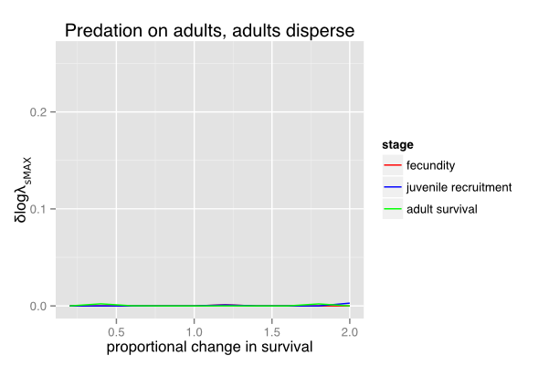

# Building a better frog trap: a theoretical model of prey habitat choice in a landscape with introduced predators. 

Rosemary Hartman

## Introduction

From deciding where to build a nest, deciding when to germinate, and deciding where to forage, to deciding what grad school will give you the best education, organisms must attempt to use available information to make choices with important fitness consequences. Most models of habitat selection within a metapopulation assume that the organism has perfect information about habitat suitability (Delibes et al. 2001a). However, human impacts may change habitat quality in ways to which organisms have not adapted. Organisms continue to make fitness choices based on traditional cues, but these cues are no longer correlated to higher fitness. These  “ecological traps” may cause a human-impacted habitat patch to become a sink for the species (Dwernychuk and Boag 1972, Robertson and Hutton 2006, Schlaepfer et al. 2005). 

Many human modifications can cause ecological traps. Introduced predators may act as a trap because native prey have not evolved to recognize them, and therefore fail to respond with anti-predator behaviors (Sih et al. 2010). If patches with predators are consistently superior in other habitat characteristics or resource availability (depth, aquatic vegetation, water chemistry, prey food resources etc) then ecological traps in the landscape could cause the entire population to decline despite the presence of predator-free patches. Other introduced species may cause inappropriate mating responses or habitat settlement cues (Schlaepfer et al. 2005). Human habitat modifications can also cause ecological traps. Some well-known examples are resort lights on beaches which cause baby sea turtules to crawl the wrong direction upon hatching, glass windows which elicit oviposition responses in mayflies, and floating garbage that resembles food to seabirds (Robertson et al 2013).

Stochastic environmental conditions may cause changes in patch quality, and while most habitat-choice literature assumes organisms to have perfect information about fitness decisions, many aspects of this literature may be relevant to ecological traps as well. Frequent changes in patch quality may mean that a patch that is a sink on average may actually have higher fitness during a particular year (Jansen and Yoshimura 1998). This could compensate for maladaptive habitat choice on the population level via a mechanism similar to intentional risk-spreading or bet-hedging on the individual level when an individual has perfect information about environmental variability (Philippi and Seger 1989). Some individuals selecting the patch that is lower quality on average may be better for metapopulation survival than all individuals selecting the high quality patch.

We have constructed a theoretical model to illustrate the dynamics of a two-patch metapopulation to see how mal-adaptive habitat choice affects population dynamics. There are many examples of metapopulation models that include habitat choice (reviewed by Piper (2011)), but there are few examples of stage-structured metapopulation models (Hunter and Caswell 2005) , and fewer still that include ecological traps (but seeDonovan and Thompson 2001, Schlaepfer et al. 2005). 

Furthermore, most ecological trap models do not look at how the presence of traps affects overall population viability. One model by Delibes et al. (Delibes et al. 2001b) examined the effects of attractive sinks in a two-patch metapopulation, but they did not include environmental stochasticy. A model of songbird breeding did include environmental stochasticity within an age-structured metapopulation (Donovan and Thompson 2001), but Donovan and Thompson’s model allowed adults to change breeding sites if they experienced nest failure. However, many animals are sedentary, or have high breeding site fidelity. Organisms without parental care must choose habitat they believe to be suitable based purely on habitat cures rather than on prior breeding success. Once they choose a patch, they remain in it or return to it year after year whether or not their young survive to adulthood (Garwood 2009).  The following model was inspired by the Cascades frog (Rana cascadae), but potentially useful to aid thinking about a number of different organisms with ontogenetic differences in dispersal across a landscape of patchily distrubuted habitats. The model is best suited to describe other r-selected species with dispersing juvenile stages and sedentary adults, such as plants or marine invertebrates, however we also explore how the model changes dispersal in only the adult life stage, as would be seen in some birds, insects and mammals.

The Cascades frog, lives high mountain lakes that were historically fishless. Humans have introduced fish into those lakes, where they prey on frog larvae (Pope 2008). Previous studies have shown a negative relationship between fish presence and frog abundance (Welsh et al. 2006), but it is unclear whether this is due to predation alone or impacts of fish on frog dispersal. Adults choosing oviposition sites may not be able to recognize the presence of these novel predators because they do not share an evolutionary history. Fish are capable of causing trophic cascades (Carpenter et al. 1985), which increase resources available to tadpoles, and decrease abundance of invertebrate predators, which tadpoles have evolved to avoid (Hokit and Blaustein 1995). Therefore, it is highly likely that adult frogs will not recognize the presence of fish in a particular lake and oviposit there due to the high resources and apparent lack of predators.

Major goals/hypotheses: 1. While maladaptive habitat selection decreases population growth more than presence of low-quality habitat patches alone,  are there situations where some dispersal to low-quality patches is better than total preference for the high-quality patch? Hypothesis: bet hedging theory (Philippi and Seger 1989) would suggest that stochastic dynamics might make it better to disperse to “lesser” habitat patches some of the time if they change environmental state separately from the better patch. 2. How do differences in life history patterns affect the relationship between ecological traps and metapopulation growth rates? Hypothesis: increases in survival of stages able to disperse will increase the benefit of dispersal toward of ecological traps, while increases in survival of resident adult life stages will decrease the benefit of dispersal toward ecological traps.

## Methods

### Study Organism

The Cascades frog is a large anuran that is endemic to the Cascades, Klamaths, and Olympic mountains of northwestern North America. These mountains contain thousands of small lakes that provide an ideal example of a metapopulation with each breeding lake serving as a patch connected by juvenile dispersal (Garwood 2009). The frogs breed explosively as soon as the surface of the breeding lake or pond is ice-free. Females lay clusters of 200-300 eggs in shallow, vegetated water, and once adults breed they have high breeding site fidelity. Larvae metamorphose in 3-5 months, juveniles take 2-3 years to reach sexual maturity, and adults may live 10-12 years (Briggs and Storm 1970). Across most of their range, they did not co-occur with any species of native fish, however trout stocked for native fisheries have since been introduced in many large lakes in their range. Trout prey on larval stages, but have a much lower effect on juvenile and adult life stages (Pope 2008). This creates a network of patches, some of which have high predation pressure and some of which have low predation pressure.

### Model Development

To simplify the Cascades frog system, we have constructed a two-patch metapopulation model with two life stages (juveniles, and adults) (Caswell 2001). One patch has predators, which effect juvenile recruitment via a predation percentage (p), describing the percent of juveniles consumed at each time step. We modeled prey abundance only, and assumed predation pressure was constant because while fish have a large effect on frog populations, frog larvae make up a very small percentage of fish diet so are unlikely to effect fish abundance (Joseph et al. 2011). The percent of larvae surviving predation is multiplied by the juvenile recruitment rate (j) to determine number of juveniles continuing on to the next time step. Predation does not effect adult survival. Adults reproduce with a patch-specific fecundity fi. Number of adults in a patch is determined by specific juvenile survival (J) and patch-specific adult survival (s). Thus, the matrix of demography for patch i is: 

$$B_i = \begin{bmatrix} 
          0 & f_1 \\
          J_i (1-p) & S_i 
        \end{bmatrix}$$
        
All juveniles disperse, and a proportion of juveniles (d) settle in the high-predation patch in proportion to the patch’s attractiveness. Juveniles are the only dispersing stage, and become adults once they settle in their destination patch. Thus, the dispersal matrix for the juvenile stage in a two-patch system is:

$$M_J = \begin{bmatrix}
          d & d-1 \\
          d-1 & d
        \end{bmatrix}$$

Combining these two matrices, the metapopulation projection matrix $A$ for a system where demography occurs before dispersal is (adapted from Hunter and Caswell 2005):

$$A = \begin{bmatrix}
        0 & f_1 & 0 & 0 \\
        J_1 (1-p) d & S_1 & J_2 d & 0 \\
        0 & 0 & 0 & f_1 \\
        J_1 (1-p)(1-d) & 0 & J_2 (1-d) & S_2 
      \end{bmatrix}$$
      
The population at time $t+1$ is determined by   where $N$ is matrix of population sizes $(n)$ of each stage  (Larvae $L$, Juveniles $J$, and Adults $s$) organized by patches.

$$N_t = \begin{bmatrix}
          n_J1 \\
          n_S1 \\
          n_J2 \\
          n_S1
        \end{bmatrix}$$
        
### Deterministic Growth

In order to see how changes in habitat selection affected population growth, we assumed density independent, deterministic growth and varied the dispersal to the patches with and without predation. Fecundity and survivorship at each life stage were chosen based on previous studies of Rana cascadae life history (average year, table 1) (Briggs and Storm 1970, Pope 2008). We assumed the only differences between the two patches are predation pressure and patch attractiveness. To test the sensitivity of the metapopulation growth rate (log $lambda$) to changes in predation and dispersal, I varied predation from 0% to 90% and varied proportion of juveniles dispersing to the high-predation patch from 0 to 0.9

### Stochastic Growth

We then introduced environmental stochasticity to the model by allowing each patch to be in one of four environmental states (table 1). Amphibians have naturally stochastic population dynamics, with survival depending on a number of environmental characteristics. We simplified this by defining years as “good”, “bad”, “average”, or “failure” where we increased or decreased the survival of all life stages simultaneously. The “failure” environmental state mimics a bad water year or late freeze which causes very low juvenile recruitment. Fecundity was not affected. Year types were chosen via a random draw based on equal probabilities of encountering each year type defined by different scenarios (Caswell 2001). We allowed the state in each patch to vary independently of the other patch, but the survival of larvae in the high-predation patch was always penalized by the same percentage no matter what the environmental state. We calculated stochastic metapopulation growth rates ($\log \lambda_s$) by averaging log of the lambdas for each year of a 100,000 year simulation with predation percentages from 0% to 100% and varied proportion of juveniles dispersing to the high-predation patch from 0 to 1.

| Environmental state | Juvenile recruitment | adult survival | fecundity |
|good|0.02|0.7|150|
|average|0.009|0.6|150|
|bad|0.002|0.2|150|
|failure|0.0001|0.5|150|

Table 1: Survival rates for each life stage in a given environmental state. Survivals of the life stages were assumed to be correlated in most instances, so a “good” year increased larval, juvenile, and adult survival. The “faliure” state is one in which a bad water year causes very few juveniles to recruit into the population.

### Local Elasticity Analysis

To test the effect of small perturbations in the vital rates of the stochastic model, we calculated the elasticity of the stochastic growth rate using numerical simulation (Caswell 2001). Briefly, we adapting the code from Caswell (2001), to generate a series of metapopulation projection matrices based on the randomly fluctuating environmental states described above. We used this to generate a series of population structure vectors (v) and growth rates (R) projected forward in time and a series of reproductive value vectors (w) projected backwards in time. The elasticity matrix is:

$$\frac{\delta \log \lambda_s}{\delta \log a_{ij}} = 
   \lim_{tf \rightarrow \infty} \frac{1}{tf} \sum_{t=0}^{T-1}
   \frac{(v(t+1)w^T(t) \circ A_t}{R_t v^T (t+1) w (t+1)}$$
   
We repeated the stochastic elasticity calculation for 100000 years and plotted the elasticity of each non-zero matrix entry when the predation was 50% and varied attractiveness of the high-predation patch from 0 to 1000 while the low predation patch was held constant at 100. We then held dispersal constant at 0.5 and varied the predation from 0% to 1%.

### Global elasticity and the value of poor information

To see how large changes in each vital rate affected log $\lambda_s$, we increased or decreased the larval, juvenile, and adult survivorship by a set percentage and plotted the change in the peak of the dispersal-growth rate curve for each change in survival. We held predation constant at 50% and changed one vital rate at a time between 0% and 200% of the baseline survival rate.

The difference between the growth rate when juveniles always disperse to the low predation patch (perfect habitat site selection), and the peak of the attractiveness-growth rate curve, can be thought of as the value of having imperfect information when making site choices. The value of poor information may change depending on the survival of the life stages that use that information. To test this, we calculated the difference in $\log \lambda_s$ from the peak of the dispersal-growth rate curve to the value at the y-intercept.

The environmental state may vary independently in a real two-patch system, but if the patches are closer together they may be more likely to encounter the same environmental state in a given year, which changes the value of poor information To see how this effected population growth rate, we varied the degree of spatial autocorrelation between patches from 0 to 1 and calculated the stochastic growth rate over 100000 years with a predation rate of 50% and varied proportion of juveniles dispersing to the high-predation patch from 0 to 1.

## Results

### Deterministic Growth

We found that increasing the dispersal to the high-predation patch tended to decrease the overall growth rate ($\lambda$) when predation was increased (see figure 1). In a single-patch system, population growth rate of the high-predation patch would be positive at 0%, 20% and 60% predation, but negative (a true sink habitat) at 80% predation. The elasticity analysis of the metapopulation projection matrix (table 2a), shows that growth rate is most elastic to changes in the non-predator patch. Within each patch, fecundity is the most important parameter, followed by adult survival.

patch|Fecundity|Migrants from predator patch|Migrants from patch non-predator patch|Adult survival
Predator|0.1190|0.0397|0.0794|0.0952
Non-predator|0.2381|0.0794|0.1587|0.1905

Table 2a: Elasticities of λ to changes in the non-zero matrix elements of the metapopulation projection matrix when they have equal dispersal and predation is 50% in the high predation patch.

### Stochastic growth

Stochastic growth rate decreased with increasing predation, and was always lower than the deterministic growth rate when they had the same average vital rates. Increasing the dispersal to the high-predation patch  increases the growth rate in a uni-model relationship (figure 1a). The peak occurs near 50% of juveniles  dispersing to the high-predation patch when predation is low, and  moves towards greater preference for the low-predation patch as the amount of predation increases (figure1b). Some dispersal to the high-predation patch always gives a greater growth rate than total avoidance of the high-predation patch, but $\log \lambda_s$ is maximized when the larger percentage goes to the low predation patch. Even with 80% predation (sink habitat), some dispersal to the sink patch results in a greater $\log \lambda_s$ than total avoidance of the sink. If the patch is a total sink (100% predation), their is no longer a uni-modal relationhsip and $\log \lambda_s$ is maximized at total avoidance of the sink.

The elasticity of log λs to changes in each entry of the metapopulation projection matrix depends greatly on how attractive the patch is and what the predation percentage is. When the predation percentage is 50% and both patches are equally attractive, the metapopulation growth rate is most elastic to changes in survivorship of the no predation patch, especially fecundity and adult survival (Table 2). 

patch|Fecundity|Migrants from predator patch|Migrants from patch non-predator patch|Adult survival
Predator|0.2953|0.0904|0.1963|0.3333
Non-predator|0.5591|0.1644|0.3472|0.6621

Table 2b: Elasticities of log λs to changes in the non-zero matrix elements of the metapopulation projection matrix when they have equal dispersal and predation is 50% in the high predation patch.

However, the relative importance of each of these matrix elements changes with changes in both dispersal and predation. When predation is held equal at 50%, increasing the proportion of juveniles moving to the high predation patch makes log λs more elastic to changes in the high predation patch matrix elements. Furthermore, juvenile migration becomes more important than fecundity when migration is strongly skewed toward one patch or the other (figure 2).

### Global elasticity of the value of poor information

Any amount of migration causes there to be some value in poor information on the population level (the peak of this curve to is above zero, see Fig 2). However, the difference between the peak of the metapopulation growth rate and the growth rate of the low-predation patch by itself (dispersal rate of 0) depends on predation and survival of each life stage (fig 3a). Increasing the adult survival decreases the value of having a proportion of juveniles disperse to the high-predation patch. Increasing juvenile survival increased the value of having a proportion of juveniles disperse to the high=predation patch.

This pattern changes with different life history strategies. If adults experince predation instead of juveniles, but juveniles are still the dispersers, increases in adult survival still leads to lowering the fitness value of dispersal toward the trap(figure 3b). Allowing adults to disperse instead of juveniles causes increases in adult survival to raise the fitness value of dispersing toward the trap (figure 3c). However, for a given set of survival and fecundity parameters, the value of the trap is lower when adults disperse than when juveniles disperse. 

 
 
 

### Spatial autocorrelation

As the degree of spatial autocorrelation increases, the height of the dispersal-growth rate curve decreases, and the dispersal rate at which the curve peaks decreases. 

## Discussion:

### The value of ecological traps

While very attractive sinks clearly decrease growth rates and equilibrium population densities, having some dispersal toward a low-quality patch is better for population growth and persistence than only having one patch. This can be caused by distribution of risk in stochastically varying populations (Cohen 1966), or increased carrying capacity in density dependent scenarios (see appendixA). The degree to which dispersal toward a sink increases population growth depends upon which life stage disperses, and the survivorship of the pre-dispersal life stage and the post-dispersal life stage.

The unimodal relationship between growth rate and attractiveness of the high-predation patch in the stochastic model is can be thought of in the same terms as bet-hedging or risk-spreading (Philippi and Seger 1989). However, bet-hedging theory generally relates to the fitness of individuals, while our model demonstrates how poor fitness consequences for some individuals can lead to higher metapopulation growth rates. While the low-predation patch has higher average juvenile recruitment, in any given year it may have lower juvenile recruitment than the high predation patch. There have been numerous other models showing how risk spreading may cause apparently maladaptive habitat choice. For example, a paper by Holt (1997) proposed that sinks are stable over evolutionary time because of high variance in survivorship at the source patch. While he also assumed organisms had perfect information on fitness in the two patches at the time they settled, the lack of knowledge of long-term dynamics makes preference for sink patches possible. A model by (Jansen and Yoshimura 1998) showed environmental stochasticity can even cause a metapopulation to persist when all patches were sinks on average. However, poor habitat choice may cause the population to decline despite the benefits using multiple patches in a stochastic environment. Remes (2000) suggested that habitat choice, rather than dispersal limitation or despotic distributions, might actually drive the production of sinks when there was misinformation on the patch’s suitability. 

### Effect of stage-structured populations

The changes in elasticity of log λs to each life stage changed as degree of dispersal and predation changed, highlighting the importance of studying the effect of habitat choice in species with different life histories. Previous work has shown how adult longevity can buffer the effect of variability across time (Benjamin S. Halpern et al. 2005), and our results support this finding. Increasing adult survival increased metapopulation survival more than an increase in larval or juvenile survival (in most scenarios), however it decreased the value of having the ecological trap on the landscape. Because only the juveniles in this model disperse, increasing juvenile recruitment allowed more individuals to take advantage of a possible good year in the high-predation patch, thus increasing the value of the trap. Adults live for multiple years, so individuals who settle in the high-predation patch will have lower average fitness than those who settle in the predator-free patch. However, adults who have some offspring dispersing to both patches will have higher fitness than those whose offspring all go to one patch or the other. Therefore, an ecological trap may be more detrimental for a species with high adult survival than for a species with high juvenile survival.

In organisms with greater adult migration than juvenile migration, higher adult survival will increase the benifits of migration toward an ecological trap, since more frequent movements as adults allow individuals to benifit from temporary good years in the high-predation patch. 

Because an dispersal to an ecological trap allways decreases individual fitness, the population benifit of dispersal to an ecological trap may not be evolutionarily stable. It will depend on whether the fitness benifit of having offspring disperse to both patches is greater than the fitness consequences of dispersing to the high predation patch.(FLESH THIS OUT MORE)

### Effect of spatial autocorrelation

Introducing spatial autocorrelation between the patches decreased the peak of the unimodal relationship between attractiveness of the trap and growth rate. It also significantly reduces the average growth rate for a given level of predation. This type of spatial synchrony makes the environment as a whole more predictable, because the high-predation patch always has lower fitness. Degree of spatial autocorrelation has previously been shown to determine amount of dispersal that optimizes population growth in source-sink metapopulation models (Schreiber 2010). More predictable environments make the strategy of high breeding site fidelity in this model less adaptive (Switzer 1993). If adults were allowed to switch patches based on previous breeding success, they may be able to overcome the lower growth rates caused by the presence of the sink patch. 

### Ecological implications

To apply this to actual populations, we would need a more precise understanding of habitat selection and variation of environmental characteristics across the landscape. If conditions in habitat patches vary independently of one another (due to local anthropogenic disturbance, residence of a mobile preditor, or microclimatic differences) then some patches that are slight ecological traps on average may buffer the population from bad years in the source and contribute positively to overall population persistence. However, correlation between environmental states in the two patches as shown in figure 4 will decrease the effectiveness of this strategy, similar to the effect of temporal correlation found by Armsworth and Roughgarden (2005) . In real systems, there are multiple factors affecting survival, some of which will be correlated between patches and some of which will be independent, resulting in a dispersal-growth rate curve somewhere in between perfect independence and perfect autocorrelation.

The cues used in habitat choice will be the most important part of calibrating this model to actual populations. As we have shown above, the effect of preference for low-quality habitat on a metapopulation is highly dependent on how strong the preference for that habitat is. Predation risk is often an important part of amphibian ovipostion site selection (reviewed in Blaustein 1999), but because Cascades frogs have not evolved with fish, and because fish may reduce the prevalence of aquatic insect predators (Pope et al. 2009), a lake with fish may appear to have lower predation pressure than it actually does. Other important cues used in ovipostion site selection include presence of conspecifics (which may correlate to low predation), presence of competitors, water quality, temperature, and hydroperiod of the pool (reviewed in Refsnider and Janzen 2010), which may or may not be more important than predation pressure  in determining larval survival. 

While our model demonstrates some dispersal to the high-predatoin patch maximizes metapopulation growth rate, the ammount of dispersal toward the low-predation patch is always greater. Therefore, if settlement cues in the high predation patch are much greater so that most or all individuals fall into this trap, it may be extermely detrimental. Also, in this model we have varied the environmental states in such a way that it is possible for the high-predation patch to have greater juvenile recruitment than the low-predation patch depending on the year type. However, if settling in a trap has such high fitness consequences that an individual in the trap is always worse off than the non-trap patch, such as total lack of juvenile recruitment, we would not expect any dispersal to the trap to benifit population growth rate.

Escape from ecological traps may occur via rapid evolution, phenotypic plasticity, or philopatry (Kokko and Sutherland. 2001). Knowing whether any of these can occur may be key to managing populations in a changing environment. Identifying where ecological traps and undervalued resources may be key for managing declining populations (Gilroy and Sutherland 2007), and remediating these traps by removing settlement cues or improving habitat may be important management tools.

## Conclusions

Maladaptive habitat selection decrease does population growth more than presence of low-quality habitat patches on their own, but stochastic dynamics and non-linear growth curves may mean a slightly attractive sink is better than one that is totally avoided. Specifics of the organisms’ life history, dispersal rates, and spatial variation in factors effecting survival are key to determining the degree to which ecological traps are helpful or detrimental to population persistence.

Altwegg, R. 2003. Multistage density dependence in an amphibian. Oecologia 136:46-50.

Benjamin S. Halpern, Steven D. Gaines, and Robert R. Warner. 2005. Habitat Size, Recruitment, and Longevity as Factors Limiting Population Size in Stage‚ÄêStructured Species. The American Naturalist 165:82-94.

Blaustein, L. 1999. Oviposition Site Selection in Response to Risk of Predation: Evidence from Aquatic Habitats and Consequences for Population Dynamics and Community Structure. Pages 441-456 in S. Wasser, editor. Evolutionary Theory and Processes: Modern Perspectives. Springer Netherlands.

Briggs, J. L. and R. M. Storm. 1970. Growth and Population Structure of the Cascade Frog, Rana cascadae Slater. Herpetologica 26:283-300.

Carpenter, S. R., J. F. Kitchell, and J. R. Hodgson. 1985. Cascading Trophic Interactions and Lake Productivity. BioScience 35:634-639.

Caswell, H. 2001. Matrix population models : construction, analysis, and interpretation. 2 edition. Sinauer Associates, Sunderland, Mass.

Cohen, D. 1966. Optimizing Reproduction in a radnomly varying environment. Journal of Theoretical Biology 12:119-129.

Delibes, M., P. Ferreras, and P. Gaona. 2001a. Attractive sinks, or how individual behavioural decisions determine source±sink dynamics. Ecology Letters 4:401-403.

Delibes, M., P. Gaona, and P. Ferreras. 2001b. Effects of an attractive sink leading into maladaptive habitat selection. The American Naturalist 158:277-285.

Donovan, T. M. and F. R. Thompson. 2001. Modeling the ecological trap hypothesis: a habitat and demographic analysis for migrant songbirds. Ecological Applications 11:871-882.

Dwernychuk, L. W. and D. A. Boag. 1972. Ducks nesting in association with gulls‚ an ecological trap? Canadian Journal of Zoology 50:559-563.

Garwood, J. 2009. Spatial ecology of the Cascades frog: identifying dispersal, migration and resource uses at multiple spatial scales. Humboldt State University, Arcata, CA.

Gilroy, J. J. and W. J. Sutherland. 2007. Beyond ecological traps: perceptual errors and undervalued resources. Trends in Ecology & Evolution 22:351-356.

Hokit, D. G. and A. R. Blaustein. 1995. Predator Avoidance and Alarm-response Behaviour in Kin-discriminating Tadpoles (Rana cascadae). Ethology 101:280-290.

Holt, R. 1997. On the evolutionary stability of sink populations. Evolutionary Ecology 11:723-731.

Howe, R. W., G. J. Davis, and V. Mosca. 1991. The Demographic Significance of 'Sink' Populations. Biological Conservation 57:239-255.

Hunter, C. M. and H. Caswell. 2005. The use of the vec-permutation matrix in spatial matrix population models. Ecological Modeling 188:15-21.

Jansen, V. A. A. and J. Yoshimura. 1998. Populations can persist in an environment consisting of sink habitats only. Proceedings of the National Academy of Sciences 95:3696-3698.

Joseph, M. B., J. Piovia-Scott, S. P. Lawler, and K. L. Pope. 2011. Indirect effects of introduced trout on Cascades frogs (Rana cascadae) via shared aquatic prey. Freshwater Biology 56:828-838.

Kokko, H. and W. J. Sutherland. 2001. Ecological traps in changing environments: ecological and evolutionary consequences of a behaviourally mediated Allee effect. Evolutionary Ecology Research 3:537-551.

Paul R. Armsworth and Joan E. Roughgarden. 2005. The Impact of Directed versus Random Movement on Population Dynamics and Biodiversity Patterns. The American Naturalist 165:449-465.

Philippi, T. and J. Seger. 1989. Hedging one's evolutionary bets, revisited. Trends in Ecology & Evolution 4:41-44.

Piper, W. 2011. Making habitat selection more “familiar”: a review. Behavioral Ecology and Sociobiology 65:1329-1351.

Pope, K. L. 2008. Assessing changes in amphibian population dynamics following experimental manipulations of introduced fish. Conservation Biology 22:1572-1581.

Pope, K. L., J. Piovia-Scott, and S. P. Lawler. 2009. Changes in aquatic insect emergence in response to whole-lake experimental manipulations of introduced trout. Freshwater Biology 54:982-993.

Refsnider, J. M. and F. J. Janzen. 2010. Putting Eggs in One Basket: Ecological and Evolutionary Hypotheses for Variation in Oviposition-Site Choice. Annual Review of Ecology, Evolution, and Systematics 41:39-57.

Remes, V. 2000. How can maladaptive habitat choice generate source-sink population dynamics? Oikos 91:579-583.

Robertson, B. A. and R. L. Hutto (2006). "A FRAMEWORK FOR UNDERSTANDING ECOLOGICAL TRAPS AND AN EVALUATION OF EXISTING EVIDENCE." Ecology 87(5): 1075-1085.

Robertson, B. A., J. S. Rehage, et al. (2013). "Ecological novelty and the emergence of evolutionary traps." Trends in Ecology & Evolution 28(9): 552-560.

Schlaepfer, M. A., P. W. Sherman, B. Blossey, and M. C. Runge. 2005. Introduced species as evolutionary traps. Ecology Letters 8:241-246.

Schreiber, S. J. 2010. Interactive effects of temporal correlations, spatial heterogeneity and dispersal on population persistence. Proceedings of the Royal Society B: Biological Sciences 277:1907-1914.

Sih, A., D. I. Bolnick, B. Luttbeg, J. L. Orrock, S. D. Peacor, Lauren M. Pintor, E. Preisser, J. S. Rehage, and J. R. Vonesh. 2010. Predator–prey naïveté, antipredator behavior, and the ecology of predator invasions. Oikos 119:610-621.

Sinclair, A. R. E. and R. P. Pech. 1996. Density Dependence, Stochasticity, Compensation and Predator Regulation. Oikos 75:164-173.

Switzer, P. V. 1993. Site fideligy in predictable and unpredicatble environments. Evolutionary Ecology 7:533-555.

Welsh, H. H., K. L. Pope, and D. Boiano. 2006. Sub-alpine amphibian distributions related to species palatability to non-native salmonids in Klamath mountains of northern California. Diversity and Distributions 12:298-309.

APPENDIX A: Density Dependence

### Density Dependent model construction

Since this model off the Cascades frog, and amphibians are most likely to experience density-dependence in their aquatic life stage, I made only the larval survivorship density dependent (Altwegg 2003).  The juvenile recruitment at time $t$ is now dependent on the number of juveniles alive at time $t (n_{Lt})$ with a rate of density dependence M. Described by an adapted version of the Beverton-Holt growth curve ($J_{it} = J_i / (1+ \frac{n_{J_{it}}}{M})$)    were $M$ is the related to the strength intra specific competition among larvae (Caswell 2001). $J_{it}$ is then multiplied by the predation percentage to determine number of juveniles in the next time step. This assumes density-dependent dynamics occur before predation, so that density dependence does not compensate for predation.

To test the effect of habitat choice on the density dependent version of the model, we plotted the probability of quasi-extinction after 500 years versus increase in proportion of juveniles dispersing to the high-predation patch (figure 5a), and the carrying capacity of each patch was 50 larvae. We set the quasi-extinction threshold for the metapopulation at 0.001 individuals. 

### results

Measuring extinction probabilities an idea of population stability in the long term. With the baseline vital rates, the population only experienced extinctions at very high predation levels (Data not shown). However, when the survival rate of adults was decreased by 40% in every scenario, the relationship between extinction probability and habitat preference was clear (figure 6). The lowest probability of extinction occurred when there was a slight preference for the low-predation patch. Extinction probabilities increased when there was total preference for the low-predation patch or preference for the high-predation patch. 

### Discussion
The density dependent scenarios also showed a unimodal relationship between dispersal to the high-predation patch and probability of extinction (Fig. 7a and b). This is similar to a model by Howe et al. (Howe et al. 1991), that found a finite percentage of sink populations increased carrying capacity of a metapopulation with density dependent dispersal. The results of this model show that habitat preference may result in similar patterns as that shown by density dependent dispersal with different amounts of sink habitat.

A high degree of density dependence may be enough to compensate for predation, also allowing a slight ecological trap to have a positive effect on overall population size and persistence. However, if a less-productive habitat is overwhelmingly preferred (which might occur with a predator-caused trophic cascade causing primary productivity to be correlated with predation) then an ecological trap may cause metapopulation extinction if frogs disperse from a low-predation patch before its carrying capacity is reached. The life stage that experiences the density dependence may also change the population dynamics. This model included density dependence only in juvenile recruitment since most studies of amphibians find this to be the most important, or only life stage with density dependent survival (Altwegg 2003). However, an organism with density dependence at a life stage less subject to predation may not be able to compensate as easily for predation losses, causing the metapopulation to fall below the expected carrying capacity (Sinclair and Pech 1996). There is also strong evidence for the buffering effect of high adult survivorship of the Cascades frog. Cascades frogs can live 10-12 years (Briggs and Storm 1970), and previous mark-recapture surveys of adult frogs showed year to year recapture probabilities of 0.73 (95% CI 0.67–0.78) (Pope 2008). The same study found that recruitment rate was more important than changes in adult survival in determining population growth rate, but our model indicates that high adult survival may be important in carrying the population through years of low recruitment. 
